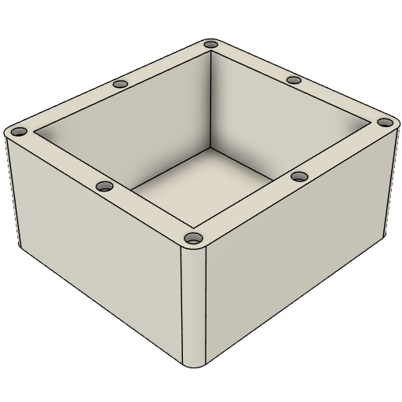
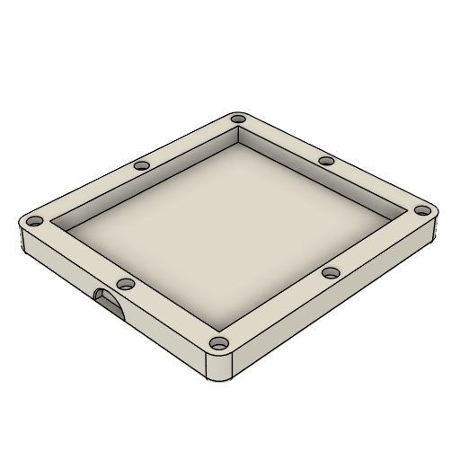
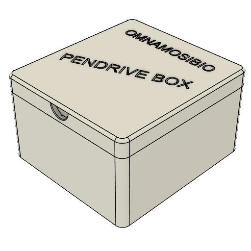

# AOICASE_PENDRIVE

## Inspiration: What I Wanted Do
I wanted to make a case to store all my father's pendrive so that he can carry the pendrives without losing it.

## What I Made
I made a case with two parts to store all my father's pendrives.

---

#### The Bottom Part - Storage Area

This is a Cube with the following Specifications-
- • Length - 120mm
- • Width - 110mm
- • Height - 55mm
- 
Also it has 8 holes for [6mm Diameter Neodymium Disc Magnets N35 with 3mm thickness](https://onlyscrews.in/products/6mm-x-3mm-neodymium-disc-magnets-n35-dia-6mm-thickness-3mm?variant=51061578367289).

---

#### The Top Part - Lid For The Storage Area

This is the lid for the Bottom Part of the Case.
It has the following features :-
- • Size: L:120mm, B:110mm & H:11mm
- • It has a grip like semi circle hole to open the lid easily.
- • It also has 8 holes for [6mm Diameter Neodymium Disc Magnets N35 with 3mm thickness](https://onlyscrews.in/products/6mm-x-3mm-neodymium-disc-magnets-n35-dia-6mm-thickness-3mm?variant=51061578367289) just like the bottom part to attach to it without any screw holes.
- • It also has a name of Indian God engraved in it i.e. Lord Shiva(OMNAMOSIBIO).

## The Problems Faced By Me 
I faced the following problems while designing the case.

1. I made the magnet holes a little long like 3 magnets would fit in each hole and also made it fat because I misinterpreted diameter in the product page as radius.
2. I asked AI to suggest me the size of the magnets. And it confused me about the thickness of magnets to use. First it told to use the thicker one(6mm) then when I asked it again after sometime it told to use the 1.5mm one. So I remaked the design then I thought the case may get opened by mistake and the pendrives can get scattered so I remade the full design again with 3mm magnet holes.
3. After the magnets were finalised and I made my design I remembered I need to add tolerances to it lol then the full design got messed up and I remade the design 2 times.
4. Finally I don't like writing paragraphs(I hate the writing portion in the English Question Paper) but I was forced to write this journal and also the README in the Github Repo.

# The Final Design

## Image Showcase
<!-- 
    This a table for showing the images of the design.
-->
#### The Render of The Final Design

#### The Separate Parts of The Case
| Bottom Part | Top Part |
| --- | --- |
|  |  |

# Bill of Materials(BOM)
| Item | Purpose | Quantity | Total Cost (USD) | Link | Distributor |
| --- | --- | ---: | ---: | --- | --- |
| 3D Print Shipping | Shipping cost of the 3D printed case | 1 | 3.35 | [Slack Channel](https://app.slack.com/client/E09V59WQY1E/C095YP8GLKT) | Souptik Samanta (#printing-legion) |
| Fevikwik Advanced Adhesive | For gluing the magnets to the case | 1 | 0.73 | [Blinkit - Fevikwik Advanced Adhesive](https://blinkit.com/prn/fevikwik-advanced-adhesive/prid/537724) | Blinkit |
| Fevikwik Gel One Drop Instant Adhesive Gel | For gluing the magnets to the case | 1 | 0.55 | [Blinkit - Fevikwik Gel One Drop Instant Adhesive Gel](https://blinkit.com/prn/fevikwik-gel-one-drop-instant-adhesive-gel/prid/425743) | Blinkit |
| 6mm Diameter Neodymium Disc Magnets N35 - 3mm | To hold the case in place | 20 | 1.90 | [OnlyScrews - 6mm Diameter Neodymium Disc Magnets N35 - 3mm](https://onlyscrews.in/products/6mm-x-3mm-neodymium-disc-magnets-n35-dia-6mm-thickness-3mm?variant=51061578367289) | OnlyScrews |
| TOTAL TAX | Tax | N/A | 0.40 | N/A | N/A |
| TOTAL SHIPPING | Shipping | N/A | 1.07 | N/A | N/A |

**Material Cost: 6.53 USD**

**Grand Total Cost (Including Tax + Shipping): 8.00 USD**
> Note: This prices are near approximately calculated from INR to USD. Also the shipping cost is given as per the shipping cost given by Souptik Samanta in the #printing-legion channel in Hack Club Slack. 
---
> Note 2: This project is only a physical case design. It only requires CAD work; no firmware or PCB is needed.

### Thanks For Reading. Sorry for the yapping. Happy Building.
